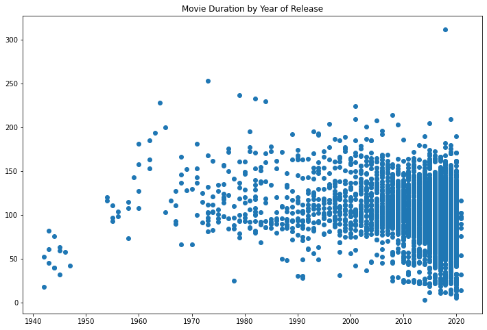

As part of the Data Science Professional learning path on DataCamp, I decided to take a hands-on approach with this project. Instead of using their ready-made materials, I created my own notebook to publish my work on GitHub. In this notebook, I put together all the code blocks I had prepared to finish my project. This allowed me to showcase my understanding and skills in a personalized way, while still following the learning path they provided.

## 1. Creating a dictionary by using lists
In this project, which started with a storytelling, we learned the average duration of the movies on Netflix over a 10-year period by a friend of ours. In this step, we are expected to transfer these data to different lists and then combine them through a dictionary.


```python
# Create the years and durations lists
years = list(range(2011,2021))
durations = [103, 101, 99, 100, 100, 95, 95, 96, 93, 90]

# Create a dictionary with the two lists
movie_dict = {
    "years" : years,
    "durations" : durations
}

# Print the dictionary
movie_dict
```


    {'years': [2011, 2012, 2013, 2014, 2015, 2016, 2017, 2018, 2019, 2020],
     'durations': [103, 101, 99, 100, 100, 95, 95, 96, 93, 90]}


## 2. Creating a DataFrame by from a dictionary
After this step, we transform the dictionary we created into a DataFrame with the help of Pandas library.


```python
# Import pandas under its usual alias
import pandas as pd

# Create a DataFrame from the dictionary
durations_df = pd.DataFrame(movie_dict)

# Print the DataFrame
print(durations_df)
```

       years  durations
    0   2011        103
    1   2012        101
    2   2013         99
    3   2014        100
    4   2015        100
    5   2016         95
    6   2017         95
    7   2018         96
    8   2019         93
    9   2020         90


## 3. Visualizing our DataFrame
To get a hands-on experience with Matplotlib, we will be visualizing the small DataFrame we have above.


```python
# Import matplotlib.pyplot under its usual alias and create a figure
import matplotlib.pyplot as plt
fig = plt.figure()

# Draw a line plot of years and durations
plt.plot(durations_df["years"], durations_df["durations"])

# Create a title
plt.title("Netflix Movie Durations 2011-2020")

# Show the plot
plt.show()
```


    

    


As you can see, in relation to the story, we can see that the duration of the films has decreased as the year passes, according to the 10 years and the average film duration given to us by our friend. But, can such a small sample provide us with a precise analysis on this issue? Now let's do the same analysis with the rest of the database.

## 4. Working with rest of the data

Now, with the help of the Pandas library, we will import your csv file and print the first 5 rows to see what dataframe look like.

*(Random data under the title column is used to anonymize the data.)*


```python
# Read in the CSV as a DataFrame
netflix_df = pd.read_csv("datasets/netflix_data.csv")

# Print the first five rows of the DataFrame
netflix_df.head(5)
```


<div>
<style scoped>
    .dataframe tbody tr th:only-of-type {
        vertical-align: middle;
    }

    .dataframe tbody tr th {
        vertical-align: top;
    }

    .dataframe thead th {
        text-align: right;
    }
</style>
<table border="1" class="dataframe">
  <thead>
    <tr style="text-align: right;">
      <th></th>
      <th>show_id</th>
      <th>type</th>
      <th>title</th>
      <th>director</th>
      <th>cast</th>
      <th>country</th>
      <th>date_added</th>
      <th>release_year</th>
      <th>duration</th>
      <th>description</th>
      <th>genre</th>
    </tr>
  </thead>
  <tbody>
    <tr>
      <th>0</th>
      <td>s1</td>
      <td>TV Show</td>
      <td>3%</td>
      <td>NaN</td>
      <td>João Miguel, Bianca Comparato, Michel Gomes, R...</td>
      <td>Brazil</td>
      <td>August 14, 2020</td>
      <td>2020</td>
      <td>4</td>
      <td>In a future where the elite inhabit an island ...</td>
      <td>International TV</td>
    </tr>
    <tr>
      <th>1</th>
      <td>s2</td>
      <td>Movie</td>
      <td>7:19</td>
      <td>Jorge Michel Grau</td>
      <td>Demián Bichir, Héctor Bonilla, Oscar Serrano, ...</td>
      <td>Mexico</td>
      <td>December 23, 2016</td>
      <td>2016</td>
      <td>93</td>
      <td>After a devastating earthquake hits Mexico Cit...</td>
      <td>Dramas</td>
    </tr>
    <tr>
      <th>2</th>
      <td>s3</td>
      <td>Movie</td>
      <td>23:59</td>
      <td>Gilbert Chan</td>
      <td>Tedd Chan, Stella Chung, Henley Hii, Lawrence ...</td>
      <td>Singapore</td>
      <td>December 20, 2018</td>
      <td>2011</td>
      <td>78</td>
      <td>When an army recruit is found dead, his fellow...</td>
      <td>Horror Movies</td>
    </tr>
    <tr>
      <th>3</th>
      <td>s4</td>
      <td>Movie</td>
      <td>9</td>
      <td>Shane Acker</td>
      <td>Elijah Wood, John C. Reilly, Jennifer Connelly...</td>
      <td>United States</td>
      <td>November 16, 2017</td>
      <td>2009</td>
      <td>80</td>
      <td>In a postapocalyptic world, rag-doll robots hi...</td>
      <td>Action</td>
    </tr>
    <tr>
      <th>4</th>
      <td>s5</td>
      <td>Movie</td>
      <td>21</td>
      <td>Robert Luketic</td>
      <td>Jim Sturgess, Kevin Spacey, Kate Bosworth, Aar...</td>
      <td>United States</td>
      <td>January 1, 2020</td>
      <td>2008</td>
      <td>123</td>
      <td>A brilliant group of students become card-coun...</td>
      <td>Dramas</td>
    </tr>
  </tbody>
</table>
</div>


## 5. Filtering our dataframe
Before doing our analysis, it is useful to focus on the "type" column in the dataframe. As you can see, TV shows are also included in this dataframe along with movies. First, let's filter our dataframe to show only movies.


```python
# Subset the DataFrame for type "Movie"
netflix_df_movies_only = netflix_df[netflix_df["type"] == "Movie"]

# Select only the columns of interest
netflix_movies_col_subset = netflix_df_movies_only[["title", "country", "genre", "release_year", "duration"]]

# Print the first five rows of the new DataFrame
netflix_movies_col_subset.head(5)
```


<div>
<style scoped>
    .dataframe tbody tr th:only-of-type {
        vertical-align: middle;
    }

    .dataframe tbody tr th {
        vertical-align: top;
    }

    .dataframe thead th {
        text-align: right;
    }
</style>
<table border="1" class="dataframe">
  <thead>
    <tr style="text-align: right;">
      <th></th>
      <th>title</th>
      <th>country</th>
      <th>genre</th>
      <th>release_year</th>
      <th>duration</th>
    </tr>
  </thead>
  <tbody>
    <tr>
      <th>1</th>
      <td>7:19</td>
      <td>Mexico</td>
      <td>Dramas</td>
      <td>2016</td>
      <td>93</td>
    </tr>
    <tr>
      <th>2</th>
      <td>23:59</td>
      <td>Singapore</td>
      <td>Horror Movies</td>
      <td>2011</td>
      <td>78</td>
    </tr>
    <tr>
      <th>3</th>
      <td>9</td>
      <td>United States</td>
      <td>Action</td>
      <td>2009</td>
      <td>80</td>
    </tr>
    <tr>
      <th>4</th>
      <td>21</td>
      <td>United States</td>
      <td>Dramas</td>
      <td>2008</td>
      <td>123</td>
    </tr>
    <tr>
      <th>6</th>
      <td>122</td>
      <td>Egypt</td>
      <td>Horror Movies</td>
      <td>2019</td>
      <td>95</td>
    </tr>
  </tbody>
</table>
</div>


Now the dataframe contains only the columns we want. Now, we can continue our analysis by visualizing the data we have.

## 6. Creating a scatter plot

This time we will use scatter plot instead of line plot to create a better presentation. In this way, we can both present the data we have more accurately and practice on different plots.


```python
# Create a figure and increase the figure size
fig = plt.figure(figsize=(12,8))

# Create a scatter plot of duration versus year
plt.scatter(netflix_movies_col_subset["release_year"], netflix_movies_col_subset["duration"])

# Create a title
plt.title("Movie Duration by Year of Release")

# Show the plot
plt.show()
```


    

    


## 7. Digging deeper

Even in its current form, it contains more information than the data given by our friend. However, at this point, there is something we should pay attention to. It seems that there are too many movies under 1 hour and this is not a situation we are used to.

Let's analyze the reason for this situation together.


```python
# Filter for durations shorter than 60 minutes
short_movies = netflix_movies_col_subset[netflix_movies_col_subset["duration"] < 60]

# Print the first 20 rows of short_movies
short_movies.head(20)
```


<div>
<style scoped>
    .dataframe tbody tr th:only-of-type {
        vertical-align: middle;
    }

    .dataframe tbody tr th {
        vertical-align: top;
    }

    .dataframe thead th {
        text-align: right;
    }
</style>
<table border="1" class="dataframe">
  <thead>
    <tr style="text-align: right;">
      <th></th>
      <th>title</th>
      <th>country</th>
      <th>genre</th>
      <th>release_year</th>
      <th>duration</th>
    </tr>
  </thead>
  <tbody>
    <tr>
      <th>35</th>
      <td>#Rucker50</td>
      <td>United States</td>
      <td>Documentaries</td>
      <td>2016</td>
      <td>56</td>
    </tr>
    <tr>
      <th>55</th>
      <td>100 Things to do Before High School</td>
      <td>United States</td>
      <td>Uncategorized</td>
      <td>2014</td>
      <td>44</td>
    </tr>
    <tr>
      <th>67</th>
      <td>13TH: A Conversation with Oprah Winfrey &amp; Ava ...</td>
      <td>NaN</td>
      <td>Uncategorized</td>
      <td>2017</td>
      <td>37</td>
    </tr>
    <tr>
      <th>101</th>
      <td>3 Seconds Divorce</td>
      <td>Canada</td>
      <td>Documentaries</td>
      <td>2018</td>
      <td>53</td>
    </tr>
    <tr>
      <th>146</th>
      <td>A 3 Minute Hug</td>
      <td>Mexico</td>
      <td>Documentaries</td>
      <td>2019</td>
      <td>28</td>
    </tr>
    <tr>
      <th>162</th>
      <td>A Christmas Special: Miraculous: Tales of Lady...</td>
      <td>France</td>
      <td>Uncategorized</td>
      <td>2016</td>
      <td>22</td>
    </tr>
    <tr>
      <th>171</th>
      <td>A Family Reunion Christmas</td>
      <td>United States</td>
      <td>Uncategorized</td>
      <td>2019</td>
      <td>29</td>
    </tr>
    <tr>
      <th>177</th>
      <td>A Go! Go! Cory Carson Christmas</td>
      <td>United States</td>
      <td>Children</td>
      <td>2020</td>
      <td>22</td>
    </tr>
    <tr>
      <th>178</th>
      <td>A Go! Go! Cory Carson Halloween</td>
      <td>NaN</td>
      <td>Children</td>
      <td>2020</td>
      <td>22</td>
    </tr>
    <tr>
      <th>179</th>
      <td>A Go! Go! Cory Carson Summer Camp</td>
      <td>NaN</td>
      <td>Children</td>
      <td>2020</td>
      <td>21</td>
    </tr>
    <tr>
      <th>181</th>
      <td>A Grand Night In: The Story of Aardman</td>
      <td>United Kingdom</td>
      <td>Documentaries</td>
      <td>2015</td>
      <td>59</td>
    </tr>
    <tr>
      <th>200</th>
      <td>A Love Song for Latasha</td>
      <td>United States</td>
      <td>Documentaries</td>
      <td>2020</td>
      <td>20</td>
    </tr>
    <tr>
      <th>220</th>
      <td>A Russell Peters Christmas</td>
      <td>Canada</td>
      <td>Stand-Up</td>
      <td>2011</td>
      <td>44</td>
    </tr>
    <tr>
      <th>233</th>
      <td>A StoryBots Christmas</td>
      <td>United States</td>
      <td>Children</td>
      <td>2017</td>
      <td>26</td>
    </tr>
    <tr>
      <th>237</th>
      <td>A Tale of Two Kitchens</td>
      <td>United States</td>
      <td>Documentaries</td>
      <td>2019</td>
      <td>30</td>
    </tr>
    <tr>
      <th>242</th>
      <td>A Trash Truck Christmas</td>
      <td>NaN</td>
      <td>Children</td>
      <td>2020</td>
      <td>28</td>
    </tr>
    <tr>
      <th>247</th>
      <td>A Very Murray Christmas</td>
      <td>United States</td>
      <td>Comedies</td>
      <td>2015</td>
      <td>57</td>
    </tr>
    <tr>
      <th>285</th>
      <td>Abominable Christmas</td>
      <td>United States</td>
      <td>Children</td>
      <td>2012</td>
      <td>44</td>
    </tr>
    <tr>
      <th>295</th>
      <td>Across Grace Alley</td>
      <td>United States</td>
      <td>Dramas</td>
      <td>2013</td>
      <td>24</td>
    </tr>
    <tr>
      <th>305</th>
      <td>Adam Devine: Best Time of Our Lives</td>
      <td>United States</td>
      <td>Stand-Up</td>
      <td>2019</td>
      <td>59</td>
    </tr>
  </tbody>
</table>
</div>


## 8. Marking genres with shorter duration
It turns out that films in the genre of stand-up, documentaries and children are also included in normal films and greatly affect the data we have. We will mark them to make this even more evident in our presentation.


```python
# Define an empty list
colors = []

# Iterate over rows of netflix_movies_col_subset
for index, row in netflix_movies_col_subset.iterrows() :
    if row["genre"] == "Children" :
        colors.append("red")
    elif row["genre"] == "Documentaries" :
        colors.append("blue")
    elif row["genre"] == "Stand-Up" :
        colors.append("green")
    else:
        colors.append("black")
        
# Inspect the first 10 values in your list        
print(colors[0:5])
```

    ['black', 'black', 'black', 'black', 'black']


## 9. Using colors in scatter plot
Now let's move this color list we have created to the plateau we have and let's see how it is.


```python
# Set the figure style and initalize a new figure
plt.style.use('fivethirtyeight')
fig = plt.figure(figsize=(12,8))

# Create a scatter plot of duration versus release_year
plt.scatter(netflix_movies_col_subset["release_year"], netflix_movies_col_subset["duration"], c=colors)

# Create a title and axis labels
plt.title("Movie duration by year of release")
plt.xlabel("Duration (min)")
plt.ylabel("Release year")

# Show the plot
plt.show()
```


    

    


It seems that the films that we can actually describe as normal are not actually shortened. Only as the years progressed, there is an increase in the number of films in the categories of stand-up, documentary and children, and this increase considerably shortens the average film duration, and this causes us to get the wrong idea that films are shortened by only looking at the average film duration.

Along with this analysis, we have seen how true or false a message our analysis can present to people. Even in the second dataframe we used, if we had made an analysis based only on the duration of the films, we would have obtained a graphic that was not much different from the graphic that our friend gave us, and we would have the impression that the films got shorter as the years passed. However, with more data and a deeper analysis, we saw together that this is not true and that there are other factors affecting the duration of the movie.
